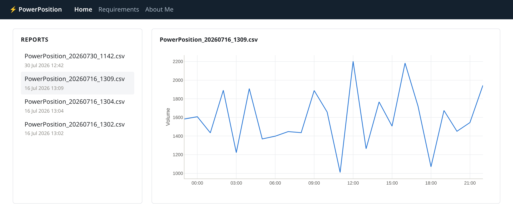

# PowerPosition

Intra-day day-ahead power position report — a .NET 10 worker service. On a
configurable interval (and once at startup) it fetches the day-ahead trades from
the trading system, aggregates volume per hour, and writes a CSV named
`PowerPosition_yyyyMMdd_HHmm.csv` (local time of extract).

| Project | What it is |
|---|---|
| `PowerPosition.Worker` | The extract worker service. |
| `PowerPosition.Web` | Blazor Server front end (see [Web front end](#web-front-end)). |
| `PowerPosition.Tests` | xUnit tests for the worker. |

## Build

```
dotnet build
```

## Test

```
dotnet test
```

## Run

```
dotnet run --project PowerPosition.Worker
```

Runs an extract at startup, then every `IntervalMinutes`. Ctrl+C to stop.

The commands above work on any OS the .NET 10 SDK supports (Windows, macOS,
Linux). The systemd instructions under [Logs](#logs) are Linux-specific.

## Settings

| Key | Default | Meaning |
|---|---|---|
| `Extract:IntervalMinutes` | `1` | Minutes between extracts. Must be 1–1440. |
| `Extract:OutputPath` | `reports` | Folder for the CSV files. Created if missing; relative to the current directory. |

From `appsettings.json`. Override on the command line (highest priority) or by
environment variable — validated at startup, bad values fail immediately.

```
dotnet run --project PowerPosition.Worker -- --Extract:IntervalMinutes 5 --Extract:OutputPath ./reports-prod
```

```
Extract__IntervalMinutes=5 Extract__OutputPath=./reports-prod dotnet run --project PowerPosition.Worker
```

Published build — same flags, no `--` separator:

```
dotnet publish PowerPosition.Worker -o out
./out/PowerPosition.Worker --Extract:IntervalMinutes 5 --Extract:OutputPath ./reports-prod
```

## Web front end

A Blazor app (`PowerPosition.Web`) with a top navigation bar over three pages:



```
dotnet run --project PowerPosition.Web
```

Then open http://localhost:5195.

Requirements and About Me are rendered on the server as static HTML. Home is the
one interactive component (`@rendermode InteractiveServer`), because selecting a
report must swap the chart without reloading the page.

### Reading the extracts

The Home page is split into two panels: the CSV files found in the extract
folder on the left, the selected one as a chart on the right. Until you pick one
the right panel shows a placeholder.

| Key | Default | Meaning |
|---|---|---|
| `Extract:OutputPath` | `../PowerPosition.Worker/reports` | Folder the reports are read from. Relative to the current directory. |

The web app reads the same `Extract:OutputPath` key as the worker, so the two
line up out of the box: run the worker once with its defaults, then start the
site and its extracts are there. Override it the same way as the worker's
settings — the site does not have to live next to the worker:

```
dotnet run --project PowerPosition.Web -- --Extract:OutputPath /var/lib/power-position/reports
```

Nothing depends on the `PowerPosition_yyyyMMdd_HHmm.csv` naming beyond showing
it in the list: the folder is scanned for `*.csv` and ordered by write time, so
any CSV with the right shape plots. That shape is a time column followed by one
or more value columns — every column after the first becomes its own line, named
after its header, so a wider CSV plots as several series without a code change.

The CSV stores only wall-clock `HH:mm` and a day-ahead trading day runs 23:00 →
22:00, so the parser rebuilds the time axis by rolling the date forward each
time the clock wraps past midnight. A file whose times never wrap plots on a
single day; the repeated hour on a DST fall-back day is kept as the file records
it.

Charts are [Plotly.Blazor](https://github.com/LayTec-AG/Plotly.Blazor) — zoom by
dragging, pan and reset from the mode bar (or double-click to reset), hover for
the period and its value, and the plot resizes with the window. The package
carries its own copy of plotly.js as a static web asset, so there is no CDN or
extra script tag.

## Logs

Logging goes to the console (see `Logging` in `appsettings.json`) — there is no
built-in file sink. To keep logs on disk when running manually, redirect
stdout/stderr yourself, e.g.:

```
mkdir -p logs
dotnet run --project PowerPosition.Worker >> logs/power-position-$(date +%Y%m%d).log 2>&1
```

If the worker runs as a systemd service instead (Linux only), systemd captures
stdout/stderr into the journal — there's no log file to redirect, so read it
with `journalctl`:

```
journalctl -u power-position.service -f       # follow live
journalctl -u power-position.service --since today
```

(Replace `power-position.service` with the actual unit name.)

For Windows Service you first need to add the
`Microsoft.Extensions.Hosting.WindowsServices` package and call
`UseWindowsService()` in `Program.cs` — the project doesn't have that yet, so
out of the box it won't run as a Windows service. Until that's added, run it
manually with the stdout redirect above, or wrap it with a third-party process
manager like NSSM.

## Notes

- **DST**: period times are stepped in 1-hour UTC increments from 23:00
  Europe/London on the previous day to 23:00 on the trading day, so a day has 23,
  24, or 25 periods — never a hardcoded 24.
- **Channel**: a bounded producer/consumer channel decouples the schedule timer
  from the extract, so a slow trading-system call delays a tick but never drops
  one (requirement 7).
- **Retry**: the trading-system fetch is retried with a fixed 3-attempt
  exponential backoff (2s then 4s); after that the extract is logged and skipped.
